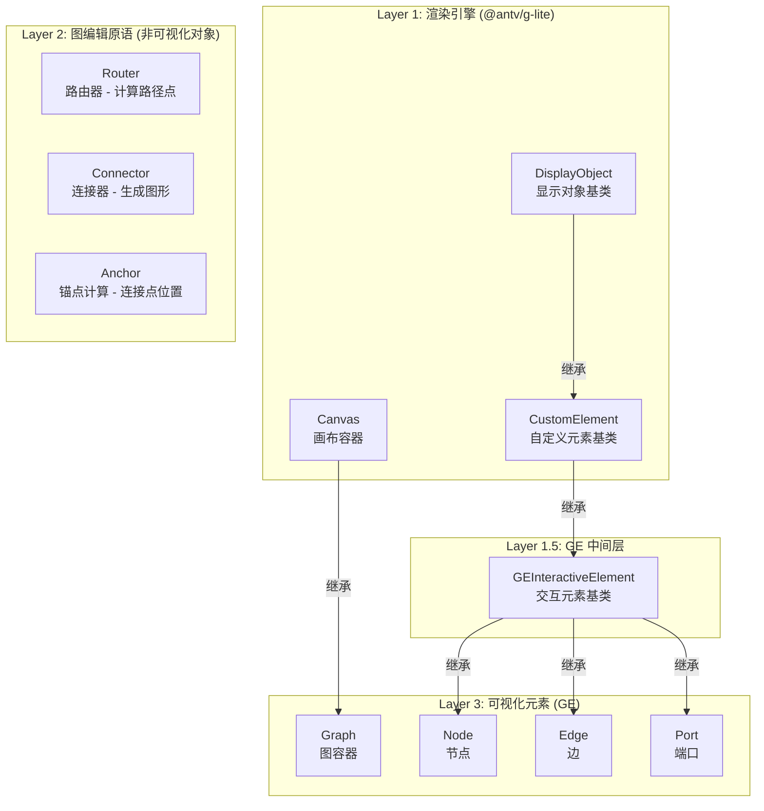
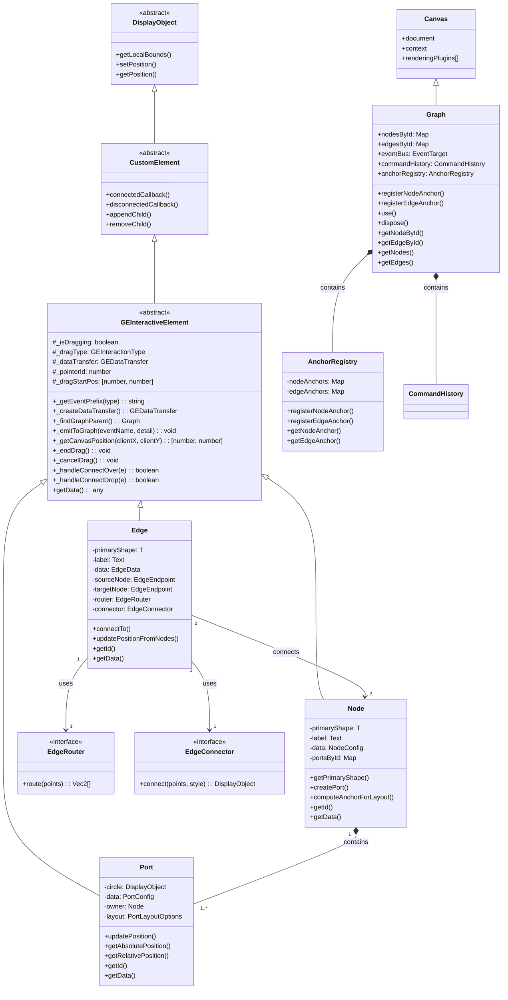
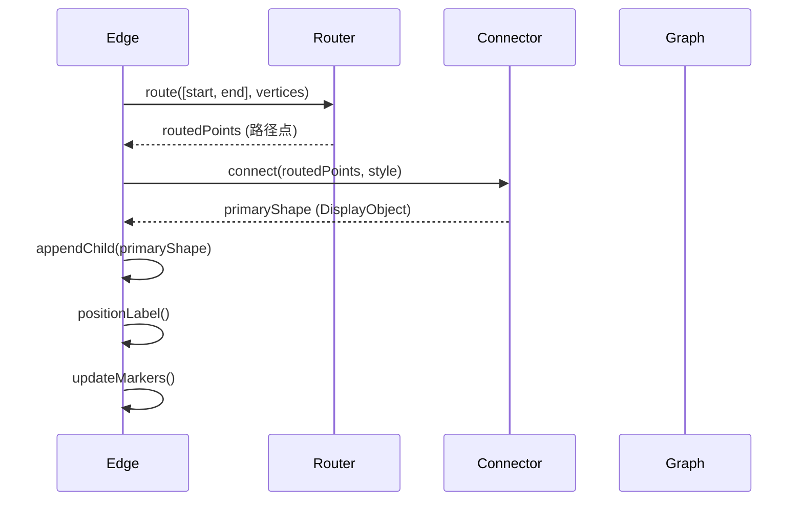
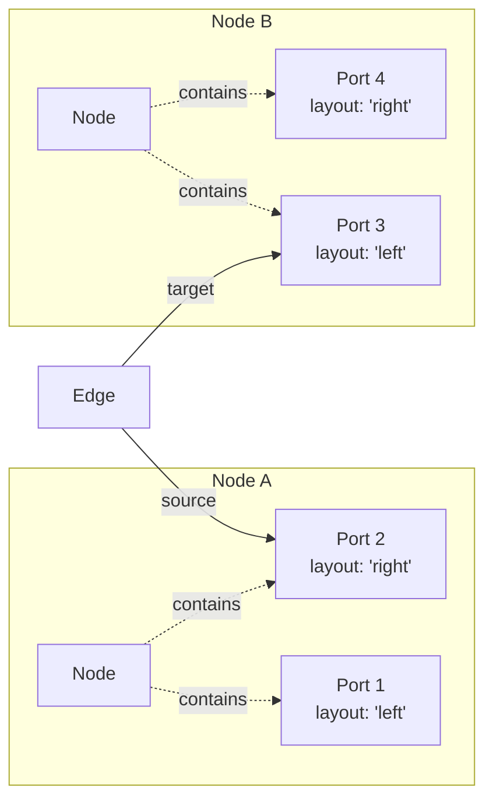
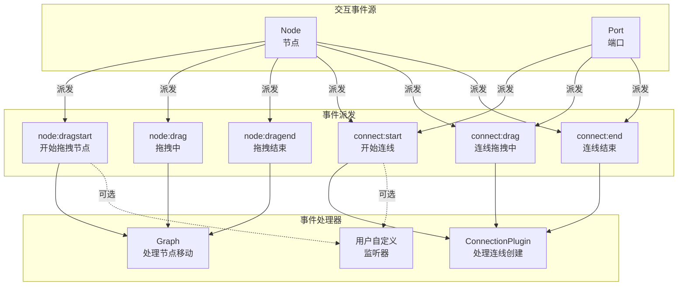
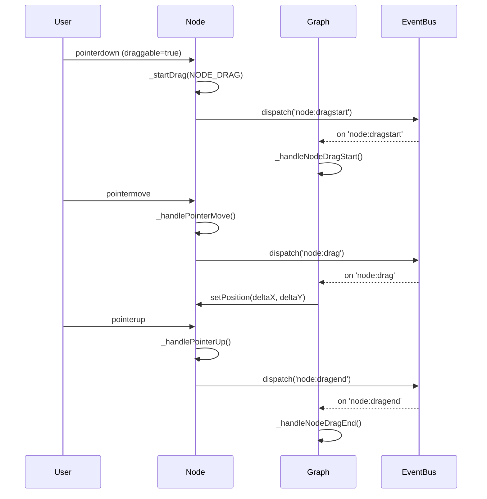
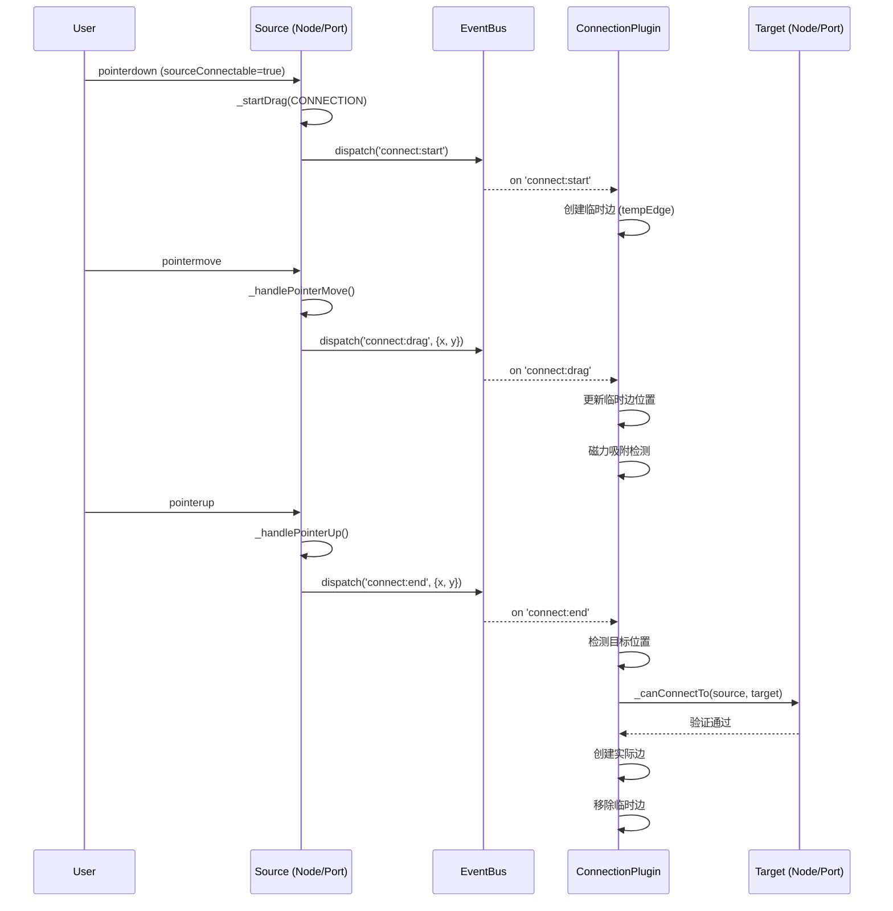
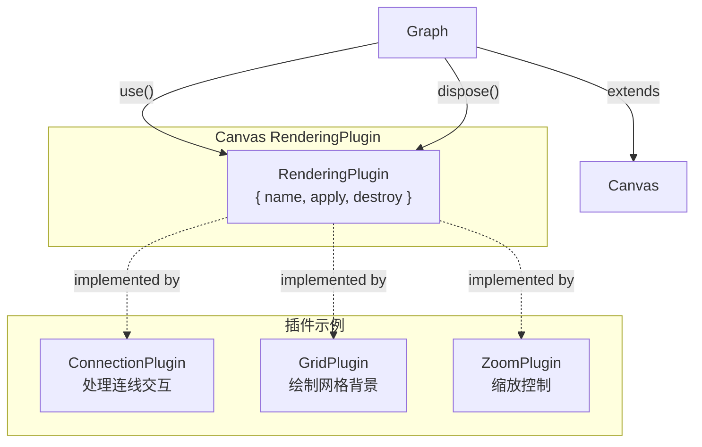

# GE (Graph Editor) 架构设计

## 3 层架构概览



## 类继承关系图



## Anchor 系统详细设计

```mermaid
graph TB
    subgraph "Anchor 数据结构"
        AnchorPoint["AnchorPoint<br/>x, y: number<br/>tangent: Vec2<br/>normal: Vec2"]
    end

    subgraph "NodeAnchor 预设"
        center["center<br/>中心点"]
        top["top<br/>顶部"]
        bottom["bottom<br/>底部"]
        left["left<br/>左侧"]
        right["right<br/>右侧"]
        angle["angle<br/>角度锚点"]
        absolute["absolute<br/>绝对位置"]
    end

    subgraph "EdgeAnchor 预设"
        start["start<br/>起点"]
        end["end<br/>终点"]
        middle["middle<br/>中点"]
        ratio["ratio<br/>比例位置"]
    end

    subgraph "注册表"
        AnchorRegistry["AnchorRegistry<br/>- nodeAnchors: Map<br/>- edgeAnchors: Map"]
    end

    AnchorPoint --> AnchorRegistry
    center --> AnchorRegistry
    top --> AnchorRegistry
    bottom --> AnchorRegistry
    left --> AnchorRegistry
    right --> AnchorRegistry
    angle --> AnchorRegistry
    absolute --> AnchorRegistry
    start --> AnchorRegistry
    end --> AnchorRegistry
    middle --> AnchorRegistry
    ratio --> AnchorRegistry

    Graph -->|"has a"| AnchorRegistry
    Node -->|"使用"| AnchorRegistry
    Edge -->|"使用"| AnchorRegistry
```

## 边绘制流程



## 节点-端口-边关系



## 事件驱动交互系统

GE 采用事件驱动的交互设计，模仿浏览器原生 Drag-and-Drop API。系统分为两套独立的事件流：



### 节点拖拽流程



### 连线创建流程



### 事件类型定义

```typescript
// 交互类型枚举
enum GEInteractionType {
  NODE_DRAG = 'ge:nodedrag',    // 节点拖拽
  CONNECTION = 'ge:connection',  // 连线创建
}

// 数据传输对象（类似浏览器 dataTransfer）
interface GEDataTransfer {
  setData(type: string, data: unknown): void;
  getData(type: string): unknown;
  hasType(type: string): boolean;
  clearData(): void;
  effectAllowed: 'move' | 'copy' | 'link' | 'none';
  dropEffect: 'move' | 'copy' | 'link' | 'none';
}

// 事件详情
interface NodeDragEventDetail {
  type: GEInteractionType;
  source: Node;
  x: number;
  y: number;
  dataTransfer: GEDataTransfer;
}

interface ConnectEventDetail {
  source: Node | Port;
  x: number;
  y: number;
  dataTransfer: GEDataTransfer;
}
```

### 配置示例

```typescript
// 节点配置
const node = graph.addNode({
  id: 'node1',
  x: 100,
  y: 100,

  // 拖拽配置
  draggable: {
    enabled: true,
    onDragStart: (e) => console.log('开始拖拽'),
    onDrag: (e) => console.log('拖拽中'),
  },

  // 作为连线源
  sourceConnectable: {
    enabled: true,
    onDragStart: (e) => console.log('开始连线'),
  },

  // 作为连线目标
  targetConnectable: {
    enabled: true,
    onDragOver: (e) => true,  // 接受悬停
    onDrop: (e) => true,       // 接受放置
  },

  // 连接验证
  connectable: (source, target) => {
    // 自定义验证逻辑
    return source.id !== target.id;
  },
});
```

## 插件系统架构



## 核心概念对照表

| 概念 | Layer | 可视化 | 基类 | 作用 |
|------|-------|--------|------|------|
| Canvas | Layer 1 | ✅ | - | 画布容器，DOM 管理 |
| CustomElement | Layer 1 | ✅ | DisplayObject | 自定义元素基类 |
| **GEInteractiveElement** | **Layer 1.5** | **❌** | **CustomElement** | **交互元素基类，共享拖拽逻辑** |
| Graph | Layer 3 | ✅ | Canvas | 图编辑容器，处理 node:drag* |
| Node | Layer 3 | ✅ | GEInteractiveElement | 节点，派发交互事件 |
| Edge | Layer 3 | ✅ | GEInteractiveElement | 边 |
| Port | Layer 3 | ✅ | GEInteractiveElement | 端口/连接桩，只支持连线 |
| Router | Layer 2 | ❌ | (纯类) | 计算路径点 |
| Connector | Layer 2 | ❌ | (纯类) | 生成图形 |
| Anchor | Layer 2 | ❌ | (策略函数) | 计算连接点 |
| ConnectionPlugin | Layer 3 | ❌ | RenderingPlugin | 处理 connect:* 事件 |

## 事件系统对照表（与浏览器 Drag-Drop API 对应）

| 浏览器 API | GE 事件 | 说明 |
|-----------|---------|------|
| `draggable="true"` | `draggable: true` | 标记元素可拖拽 |
| `ondragstart` | `node:dragstart` / `connect:start` | 开始拖拽 |
| `ondrag` | `node:drag` / `connect:drag` | 拖拽中 |
| `ondragend` | `node:dragend` / `connect:end` | 拖拽结束 |
| `ondragover` | `connect:over` | 悬停在目标上 |
| `ondrop` | `connect:drop` | 放置到目标 |
| `dataTransfer` | `GEDataTransfer` | 拖拽数据传输 |

## 设计模式应用

| 模式 | 应用位置 | 说明 |
|------|----------|------|
| 继承模式 | Graph extends Canvas | 复用 Canvas 的渲染能力 |
| **中间层模式** | **GEInteractiveElement** | **共享交互逻辑，减少代码重复** |
| 组合模式 | Node 包含 primaryShape + label + ports | 灵活组合可视化元素 |
| 策略模式 | Router/Connector/Anchor | 可替换的算法实现 |
| 注册表模式 | AnchorRegistry, customElements | 可扩展的组件注册 |
| 观察者模式 | EventBus, 事件派发 | 事件通信，解耦组件 |
| **事件发射器模式** | **Node/Port 派发事件** | **分离事件发射和处理** |
| 插件模式 | RenderingPlugin | 功能扩展，ConnectionPlugin 处理连线 |
