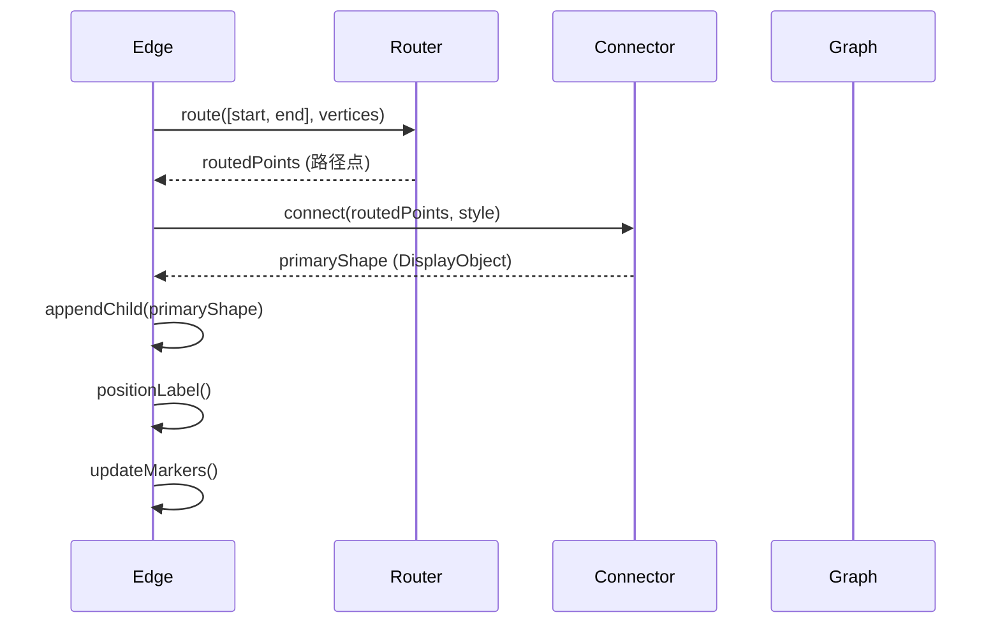
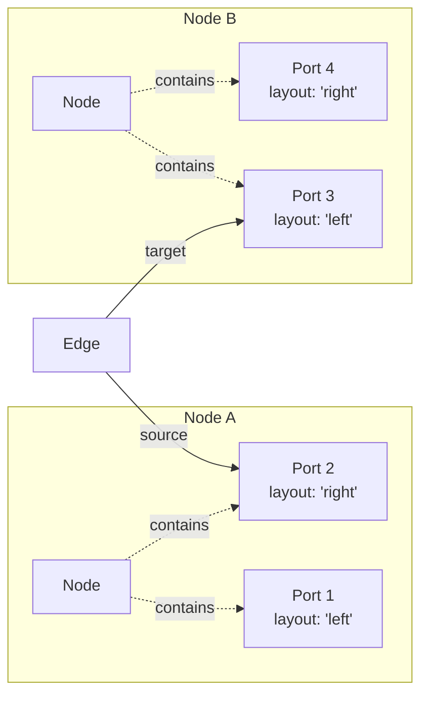
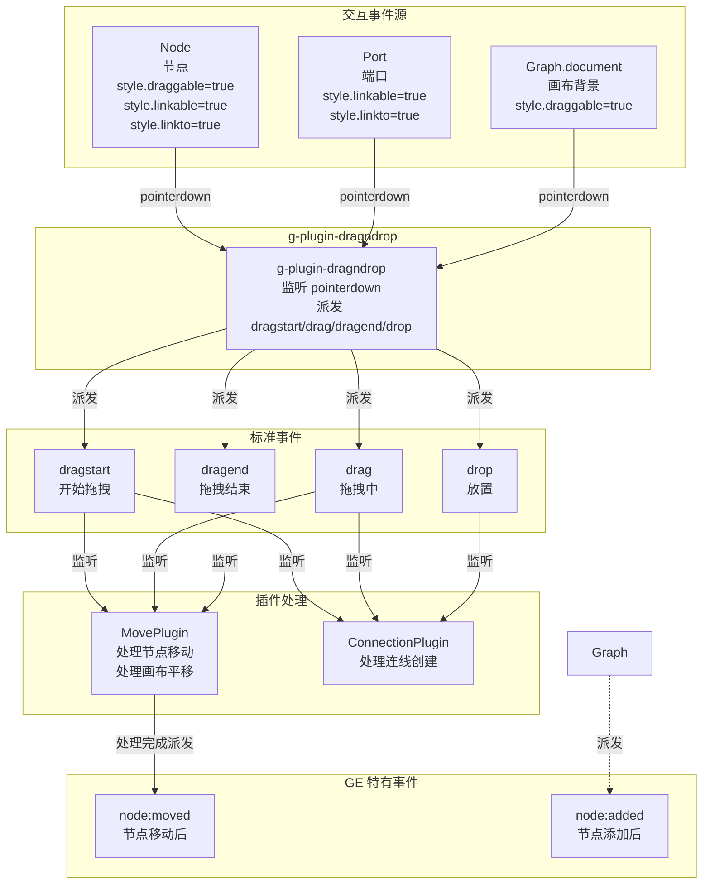
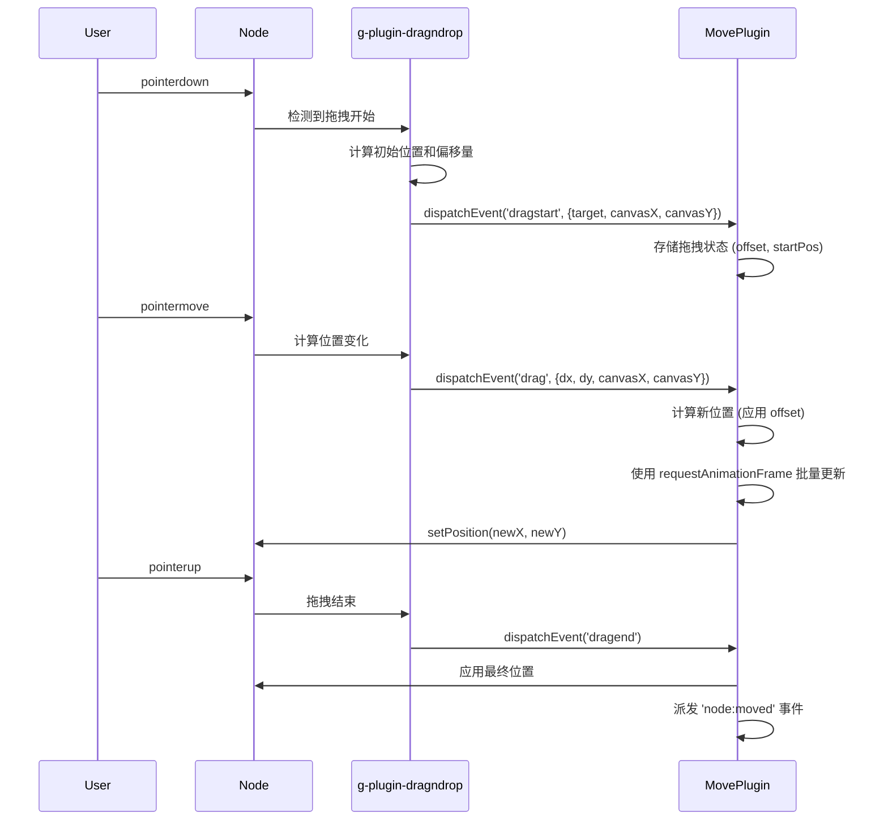
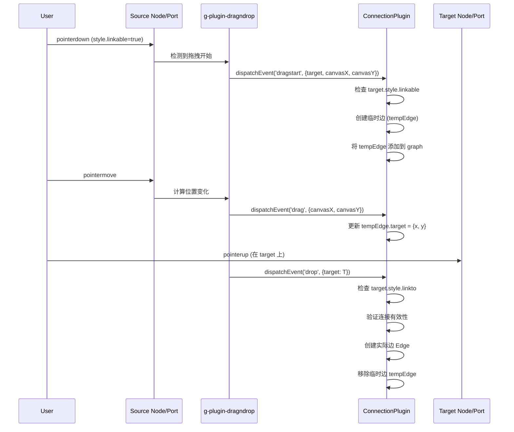
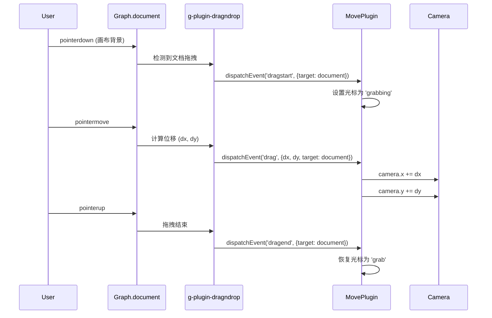
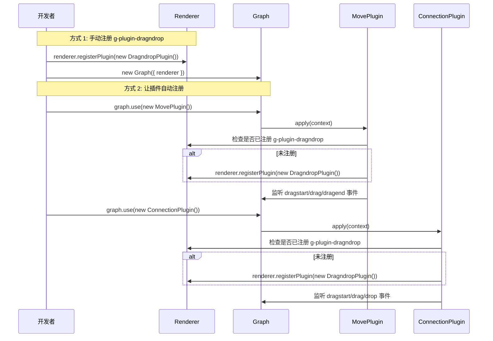

# GE (Graph Editor) 架构设计

## 3 层架构概览

```mermaid
graph TB
    subgraph "Layer 1: 渲染引擎 (@antv/g-lite)"
        Canvas["Canvas<br/>画布容器"]
        CustomElement["CustomElement<br/>自定义元素基类"]
        DisplayObject["DisplayObject<br/>显示对象基类"]
    end

    subgraph "Layer 1.5: GE 中间层"
        GEInteractive["GEInteractiveElement<br/>交互元素基类<br/>- primaryShape/labelShape 管理<br/>- ID 生成和管理<br/>- 双击支持<br/>- 光标样式"]
        ItemElement["ItemElement<br/>集合管理基类<br/>- tools[] 集合<br/>- ports[] 集合<br/>- labels[] 集合<br/>- distributeItems() 布局算法"]
        ItemToolElement["ItemToolElement<br/>单项定位基类<br/>- owner 引用<br/>- calculatePosition() 统一定位<br/>- distance/offset/angle 参数<br/>- getSiblings()/getIndex()"]
    end

    subgraph "Layer 2: 图编辑原语 (非可视化对象)"
        Router["Router<br/>路由器 - 计算路径点"]
        Connector["Connector<br/>连接器 - 生成图形"]
        Anchor["Anchor<br/>锚点计算 - 连接点位置"]
    end

    subgraph "Layer 3: 可视化元素 (GE)"
        Graph["Graph<br/>图容器"]
        Node["Node<br/>节点"]
        Edge["Edge<br/>边"]
        Port["Port<br/>端口"]
    end

    subgraph "Layer 4: 插件层"
        DragndropPlugin["g-plugin-dragndrop<br/>官方拖拽插件"]
        MovePlugin["MovePlugin<br/>节点移动"]
        ConnectionPlugin["ConnectionPlugin<br/>连线创建"]
    end

    Canvas -->|"继承"| Graph
    CustomElement -->|"继承"| GEInteractive
    GEInteractive -->|"继承"| ItemElement
    GEInteractive -->|"继承"| ItemToolElement
    ItemElement -->|"继承"| Node
    ItemElement -->|"继承"| Edge
    ItemToolElement -->|"继承"| Port
    DisplayObject -->|"继承"| CustomElement

    DragndropPlugin -.-"监听"
    MovePlugin -.-"监听"
    ConnectionPlugin -.-"监听"
```

## 类继承关系图

```mermaid
classDiagram
    %% g-lite 基础类
    class DisplayObject {
        <<abstract>>
        +getLocalBounds()
        +setPosition()
        +getPosition()
    }

    class CustomElement {
        <<abstract>>
        +connectedCallback()
        +disconnectedCallback()
        +appendChild()
        +removeChild()
    }

    class Canvas {
        +document
        +context
        +renderingPlugins[]
    }

    %% GE 中间层
    class GEInteractiveElement {
        <<abstract>>
        #primaryShape: TShape
        +getId(): string
        +getPrimaryShape(): TShape
        +getLabelShape(): Text
        +setLabelShape(config): void
        +_isDraggable(): boolean
        +_isSourceConnectable(): boolean
        +_isTargetConnectable(): boolean
        +_applyCursorStyleTo(target)
        +_setupDblClick(element)
    }

    class ItemElement {
        <<abstract>>
        #tools: ItemToolElement[]
        #ports: ItemToolElement[]
        #labels: ItemToolElement[]
        +distributeItems(items): void
        +_trackItem(item, type): void
        +_untrackItem(item, type): void
        +getTools(): ItemToolElement[]
        +getPorts(): ItemToolElement[]
        +getLabels(): ItemToolElement[]
    }

    class ItemToolElement {
        <<abstract>>
        #_owner: ItemElement
        #position: {distance, offset, angle}
        #layout: string | PortLayoutOptions
        +calculatePosition(): Vec2
        +calculatePositionOnPath(path, t): Vec2
        +calculatePositionOnShape(shape, layout): Vec2
        +applyOffsetAndAngle(point, tangent): Vec2
        +getSiblings(): ItemToolElement[]
        +getIndex(): number
        +updateDistributedPosition(index, count): void
    }

    %% GE 可视化元素
    class Graph {
        +nodesById: Map
        +edgesById: Map
        +addEventListener()
        +removeEventListener()
        +dispatchEvent()
        +anchorRegistry: AnchorRegistry
        +registerNodeAnchor()
        +registerEdgeAnchor()
        +use()
        +dispose()
        +getNodeById()
        +getEdgeById()
        +getNodes()
        +getEdges()
    }

    class Node {
        -primaryShape: T
        -label: Text
        -data: NodeConfig
        +appendChild(child): this
        +removeChild(child): this
        +getPrimaryShape()
        +createPort(config): Port
        +getPort(id): Port
        +getPorts(): Port[]
        +computeAnchorForLayout()
        +getId()
        +getData()
    }

    class Edge {
        -primaryShape: T
        -labels: Map<string, Text>
        -data: EdgeData
        -sourceNode: EdgeEndpoint
        -targetNode: EdgeEndpoint
        -router: EdgeRouter
        -connector: EdgeConnector
        +getLabelShape(): Text
        +addLabel(id, config): Text
        +removeLabel(id): void
        +getLabel(id): Text
        +connectTo()
        +updatePositionFromNodes()
        +getId()
        +getData()
    }

    class Port {
        -primaryShape: T
        -data: PortConfig
        -owner: Node
        -layout: PortLayoutOptions
        +updatePosition()
        +getAbsolutePosition()
        +getRelativePosition()
        +getId()
        +getData()
    }

    %% Layer 2 原语
    class EdgeRouter {
        <<interface>>
        +route(points): Vec2[]
    }

    class EdgeConnector {
        <<interface>>
        +connect(points, style): DisplayObject
    }

    class AnchorRegistry {
        -nodeAnchors: Map
        -edgeAnchors: Map
        +registerNodeAnchor()
        +registerEdgeAnchor()
        +getNodeAnchor()
        +getEdgeAnchor()
    }

    %% 插件
    class RenderingPlugin {
        <<interface>>
        +name: string
        +apply(context, runtime): void
        +destroy(): void
    }

    class MovePlugin {
        +name: 'move'
        +apply(context): void
        +destroy(): void
    }

    class ConnectionPlugin {
        +name: 'connection'
        +apply(context): void
        +destroy(): void
    }

    %% 继承关系
    DisplayObject <|-- CustomElement
    CustomElement <|-- GEInteractiveElement
    GEInteractiveElement <|-- ItemElement
    GEInteractiveElement <|-- ItemToolElement
    Canvas <|-- Graph
    ItemElement <|-- Node
    ItemElement <|-- Edge
    ItemToolElement <|-- Port

    %% 插件实现
    RenderingPlugin <|.. MovePlugin
    RenderingPlugin <|.. ConnectionPlugin

    %% 组合关系
    Graph *-- AnchorRegistry : contains
    Graph "1" --> "0..*" RenderingPlugin : uses
    Node "1" *-- "1..*" Port : contains
    Edge "1" --> "1" EdgeRouter : uses
    Edge "1" --> "1" EdgeConnector : uses
    Edge "2" --> "2" Node : connects
```

## Anchor 系统详细设计

```mermaid
graph TB
    subgraph "Anchor 数据结构"
        AnchorPoint["AnchorPoint<br/>x, y: number<br/>tangent: Vec2<br/>normal: Vec2"]
    end

    subgraph "NodeAnchor 预设"
        center["center<br/>中心点"]
        top["top<br/>顶部"]
        bottom["bottom<br/>底部"]
        left["left<br/>左侧"]
        right["right<br/>右侧"]
        angle["angle<br/>角度锚点"]
        absolute["absolute<br/>绝对位置"]
    end

    subgraph "EdgeAnchor 预设"
        start["start<br/>起点"]
        end["end<br/>终点"]
        middle["middle<br/>中点"]
        ratio["ratio<br/>比例位置"]
    end

    subgraph "注册表"
        AnchorRegistry["AnchorRegistry<br/>- nodeAnchors: Map<br/>- edgeAnchors: Map"]
    end

    AnchorPoint --> AnchorRegistry
    center --> AnchorRegistry
    top --> AnchorRegistry
    bottom --> AnchorRegistry
    left --> AnchorRegistry
    right --> AnchorRegistry
    angle --> AnchorRegistry
    absolute --> AnchorRegistry
    start --> AnchorRegistry
    end --> AnchorRegistry
    middle --> AnchorRegistry
    ratio --> AnchorRegistry

    Graph -->|"has a"| AnchorRegistry
    Node -->|"使用"| AnchorRegistry
    Edge -->|"使用"| AnchorRegistry
```

## 边绘制流程



## 节点-端口-边关系



## 基于 g-plugin-dragndrop 的事件系统

GE 使用 @antv/g 的官方 [g-plugin-dragndrop](https://g.antv.antgroup.com/en/plugins/dragndrop) 插件，该插件基于 PointerEvents 实现，提供标准 DOM 风格的拖拽事件。



### 节点拖拽流程



### 连线创建流程



### 画布平移流程



## 插件系统架构

```mermaid
graph TB
    subgraph "RenderingPlugin 接口"
        Plugin["RenderingPlugin<br/>{ name, apply, destroy }"]
    end

    subgraph "Level 1: Renderer 插件"
        Dragndrop["g-plugin-dragndrop<br/>官方拖拽插件<br/>renderer.registerPlugin()"]
    end

    subgraph "Level 2: Graph 插件"
        Move["MovePlugin<br/>处理节点移动<br/>处理画布平移"]
        Conn["ConnectionPlugin<br/>处理连线创建"]
        Other["其他插件..."]
    end

    subgraph "注册方式"
        R1["renderer.registerPlugin()<br/>渲染级别插件"]
        R2["graph.use()<br/>应用级别插件"]
    end

    Plugin -.-"实现于"
    Dragndrop -.-"实现于"
    Move -.-"实现于"
    Conn -.-"实现于"
    Other -.-"实现于"

    Dragndrop -->|"注册于"| R1
    Move -->|"注册于"| R2
    Conn -->|"注册于"| R2
    Other -->|"注册于"| R2
```

### 插件注册流程



## 核心概念对照表

| 概念 | Layer | 可视化 | 基类 | 作用 |
|------|-------|--------|------|------|
| Canvas | Layer 1 | ✅ | - | 画布容器，DOM 管理 |
| CustomElement | Layer 1 | ✅ | DisplayObject | 自定义元素基类 |
| **GEInteractiveElement** | **Layer 1.5** | **❌** | **CustomElement** | **交互元素基类：primaryShape/labelShape 管理、ID 生成** |
| **ItemElement** | **Layer 1.5** | **❌** | **GEInteractiveElement** | **集合管理基类：tools/ports/labels 数组、distributeItems 布局** |
| **ItemToolElement** | **Layer 1.5** | **❌** | **GEInteractiveElement** | **单项定位基类：owner 引用、calculatePosition 统一定位** |
| Graph | Layer 3 | ✅ | Canvas | 图编辑容器，插件管理 |
| Node | Layer 3 | ✅ | ItemElement | 节点，管理 ports 集合 |
| Edge | Layer 3 | ✅ | ItemElement | 边，管理 labels 集合 |
| Port | Layer 3 | ✅ | ItemToolElement | 端口/连接桩，位置计算 |
| Router | Layer 2 | ❌ | (纯类) | 计算路径点 |
| Connector | Layer 2 | ❌ | (纯类) | 生成图形 |
| Anchor | Layer 2 | ❌ | (策略函数) | 计算连接点 |
| g-plugin-dragndrop | Layer 4 | ❌ | RenderingPlugin | 官方拖拽插件，派发标准事件 |
| MovePlugin | Layer 4 | ❌ | RenderingPlugin | 处理节点移动、画布平移 |
| ConnectionPlugin | Layer 4 | ❌ | RenderingPlugin | 处理连线创建 |

## 事件系统对照表

| g-plugin-dragndrop 事件 | GE 插件处理者 | 说明 |
|----------------------|--------------|------|
| `dragstart` | MovePlugin, ConnectionPlugin | 开始拖拽 |
| `drag` | MovePlugin, ConnectionPlugin | 拖拽中 |
| `dragend` | MovePlugin | 拖拽结束 |
| `drop` | ConnectionPlugin | 放置到目标 |
| `dragenter` | - | 进入放置区（预留） |
| `dragleave` | - | 离开放置区（预留） |
| `dragover` | - | 在放置区上方（预留） |

| GE 特有事件 | 派发者 | 说明 |
|-----------|-------|------|
| `node:moved` | Node | 节点移动完成后 |
| `node:added` | Graph | 节点添加到图后 |

## 配置对照表

| 配置属性 | 位置 | 作用 | 对应 g-plugin-dragndrop |
|---------|------|------|---------------------|
| `style.draggable` | Node/Port | 可拖拽移动 | draggable |
| `style.linkable` | Node/Port | 可作为连线源 | draggable + ConnectionPlugin 处理 |
| `style.linkto` | Node/Port | 可作为连线目标 | droppable + ConnectionPlugin 处理 |
| `document.style.draggable` | Graph | 画布可拖拽（平移） | isDocumentDraggable |
| `graph.draggable` | Graph 配置 | 设置画布光标为 grab | - |

## 设计模式应用

| 模式 | 应用位置 | 说明 |
|------|----------|------|
| 继承模式 | Graph extends Canvas | 复用 Canvas 的渲染能力 |
| **中间层模式** | **GEInteractiveElement** | **共享 ID 管理、Shape 管理，减少代码重复** |
| 组合模式 | Node 包含 primaryShape + label + ports | 灵活组合可视化元素 |
| 策略模式 | Router/Connector/Anchor | 可替换的算法实现 |
| 注册表模式 | AnchorRegistry, customElements | 可扩展的组件注册 |
| 观察者模式 | DOM 事件系统 (addEventListener/dispatchEvent) | 事件通信，解耦组件 |
| **插件模式** | **RenderingPlugin** | **功能扩展，g-plugin-dragndrop 提供底层拖拽** |
| 事件委托 | Graph 级别监听事件 | 统一处理多个元素的交互 |
| 防重复注册 | renderer.plugins 检查 | 避免重复注册 g-plugin-dragndrop |

## 配置示例

### 节点配置

```typescript
// 基础节点
const node = new Node({
  id: 'node1',
  x: 100,
  y: 100,
  style: {
    width: 100,
    height: 60,
    fill: '#f0f0f0',
    draggable: true,   // 可拖拽
    linkable: true,    // 可作为连线源
    linkto: true,      // 可作为连线目标
  },
});

graph.appendChild(node);
```

### 插件配置

```typescript
// 注册 g-plugin-dragndrop（可选，插件会自动注册）
const renderer = new CanvasRenderer();
renderer.registerPlugin(new DragndropPlugin({
  isDocumentDraggable: true,  // 启用画布拖拽
}));

// 创建图
const graph = new Graph({
  container: 'container',
  width: 800,
  height: 600,
  draggable: true,  // 设置画布可拖拽（显示 grab 光标）
  renderer,
});

// 使用插件
graph.use(new MovePlugin({
  snapToGrid: true,
  gridSize: 10,
}));

graph.use(new ConnectionPlugin({
  defaultEdgeStyle: {
    stroke: '#1890ff',
    lineWidth: 2,
  },
}));
```

### 端口配置

```typescript
const node = new Node({
  id: 'node1',
  x: 100,
  y: 100,
  style: { width: 100, height: 60, fill: '#f0f0f0' },
});

// 创建可连线端口
node.createPort({
  id: 'output',
  layout: 'right',
  style: {
    linkable: true,   // 可作为连线源
  },
});

node.createPort({
  id: 'input',
  layout: 'left',
  style: {
    linkto: true,     // 可作为连线目标
  },
});

graph.appendChild(node);
```

## 与旧系统的迁移

### 旧配置（已弃用）

```typescript
// ❌ 旧方式
const node = new Node({
  draggable: true,
  sourceConnectable: true,  // 已弃用
  targetConnectable: true,  // 已弃用
});
```

### 新配置

```typescript
// ✅ 新方式
const node = new Node({
  style: {
    draggable: true,
    linkable: true,   // 替代 sourceConnectable
    linkto: true,     // 替代 targetConnectable
  },
});
```

### 旧事件（已弃用）

```typescript
// ❌ 旧事件
graph.addEventListener('node:dragstart', ...);
graph.addEventListener('node:drag', ...);
graph.addEventListener('node:dragend', ...);
graph.addEventListener('connect:start', ...);
graph.addEventListener('connect:drag', ...);
graph.addEventListener('connect:end', ...);
```

### 新事件

```typescript
// ✅ 新事件（g-plugin-dragndrop 标准事件）
graph.addEventListener('dragstart', ...);
graph.addEventListener('drag', ...);
graph.addEventListener('dragend', ...);
graph.addEventListener('drop', ...);

// ✅ GE 特有事件（应用层使用）
graph.addEventListener('node:moved', ...);
graph.addEventListener('node:added', ...);
```

## 参考

- [g-plugin-dragndrop 官方文档](https://g.antv.antgroup.com/en/plugins/dragndrop)
- [EVENTS.md](./EVENTS.md) - 事件系统详细文档
- [MovePlugin 源码](../src/plugins/MovePlugin.ts)
- [ConnectionPlugin 源码](../src/plugins/ConnectionPlugin.ts)
- [GEInteractiveElement 源码](../src/core/GEInteractiveElement.ts)
